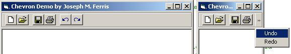



## Toolbars with Chevrons Demo

### Description

Chevrons are buttons that display a popup menu when there are more items on a toolbar than room to display them. All items that overflow the width of the toolbar are dynamically added to a popup menu to display them.

Special thanks to Night Wolf for use of the Gold Button control which can be found here on Planet Source Code.

Please vote if you like it, and drop me a line if you have any questions.
 
### More Info
 

             |
---                |---
**Submitted On**   |2000-08-29 16:10:26
**By**             |[Joseph M\. Ferris](https://github.com/Planet-Source-Code/PSCIndex/blob/master/ByAuthor/joseph-m-ferris.md)
**Level**          |Advanced
**User Rating**    |4.4 (48 globes from 11 users)
**Compatibility**  |VB 6\.0
**Category**       |[Custom Controls/ Forms/  Menus](https://github.com/Planet-Source-Code/PSCIndex/blob/master/ByCategory/custom-controls-forms-menus__1-4.md)
**World**          |[Visual Basic](https://github.com/Planet-Source-Code/PSCIndex/blob/master/ByWorld/visual-basic.md)
**Archive File**   |[CODE\_UPLOAD94158292000\.zip](https://github.com/Planet-Source-Code/joseph-m-ferris-toolbars-with-chevrons-demo__1-11091/archive/master.zip)

